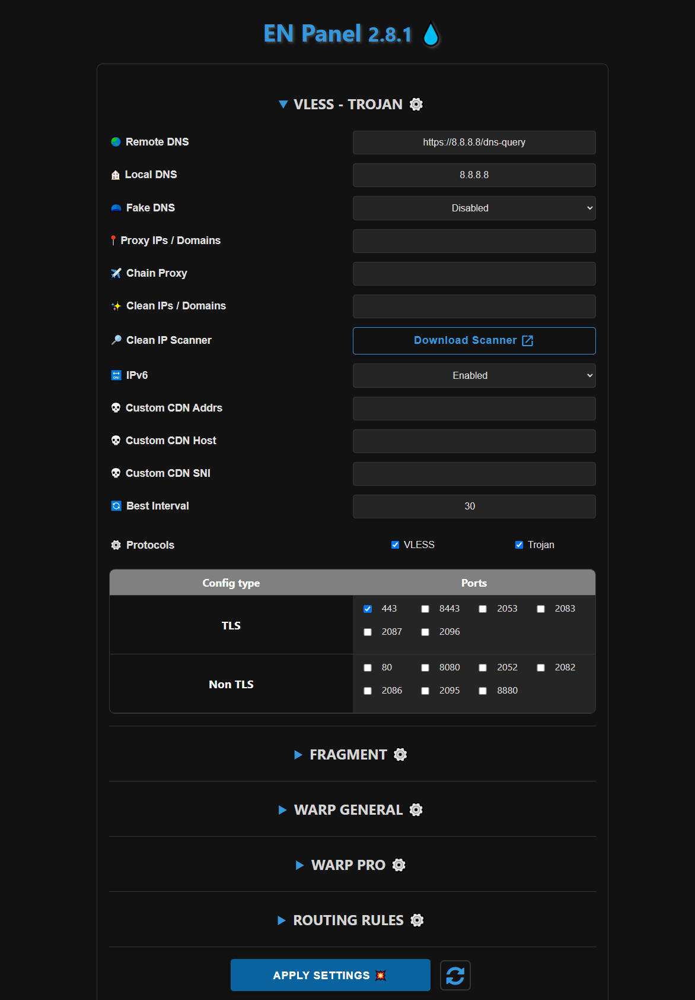
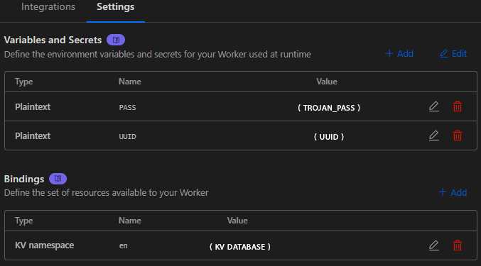
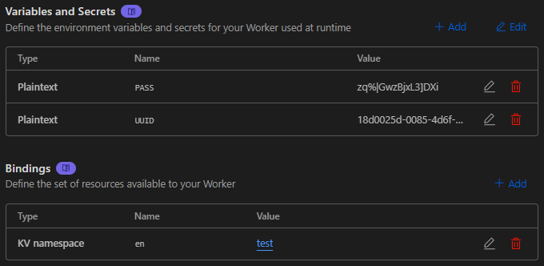

<h1 align="center">💧 BPB-Panel EN 💧</h1>

  

 

## ⭐ تغییرات نسخه BPB-Panel EN

- رفع ارور 1101
- کلمات VLESS و TROJAN از ورکر حذف شد و با کلمات رندوم جایگزین شد

**این ورکر توسط مبهم ساز شخصی خودم که با پایتون و Node.js و کتابخانه javascript-obfuscator مبهم سازی شده!**
 

 

## 📥 نحوه نصب BPB-Panel
- اول از همه ورکر را دانلود کنید
- در cloudflare بخش Worker & Pages بروید و یک Worker یا Pages جدید بسازید.
- بعد ورکر را آپلود کنید.
- بعد به بخش settings بروید و طبق تصویر زیر تنظیمات را روی ورکر خود اعمال کنید.

  

  

## 📜 توضیحات
- پنل BPB اصلی : https://github.com/bia-pain-bache/BPB-Worker-Panel
- این پروژه فعلا برای رفع مشکل 1101 درحال فعالیت هستش ، اگر نسخه اصلی BPB Panel این مشکل را برطرف کند ، این پروژه برای همیشه متوقف خواهد شد

 
